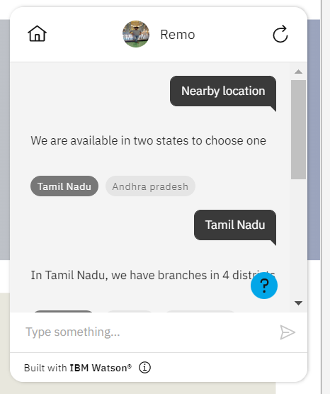
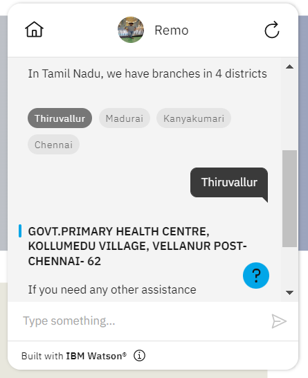
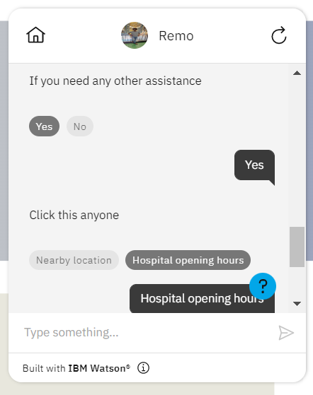
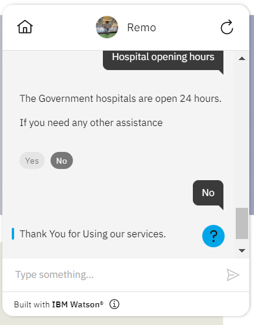
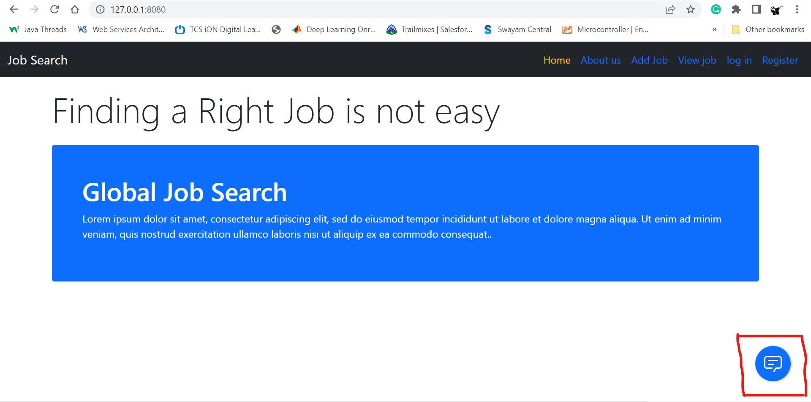
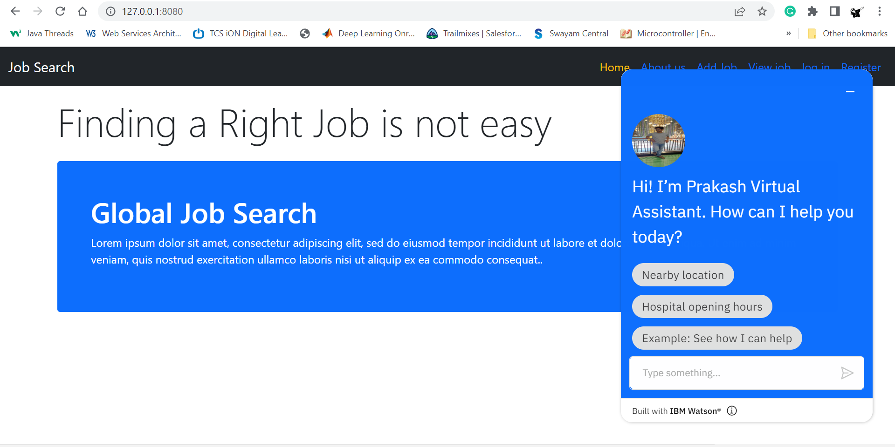

# Assignment 3

- Created bucket in IBM object storage and the images are uploaded and kept view as public and the images are fetched in webpage. Here the link to view output https://gallery-flask-webapp.herokuapp.com/ 
- Created Bot with the help of IBM watson assistant branches for hospital in your city. Here is the link to view output [preview](https://web-chat.global.assistant.watson.appdomain.cloud/preview.html?backgroundImageURL=https%3A%2F%2Fau-syd.assistant.watson.cloud.ibm.com%2Fpublic%2Fimages%2Fupx-8187f921-dbf2-4b32-bc7f-205c659d2495%3A%3Adeae5668-62e8-471e-9f87-a3f9370864a4&integrationID=bae1d2fa-58fd-4176-9ba7-88701dab52bf&region=au-syd&serviceInstanceID=8187f921-dbf2-4b32-bc7f-205c659d2495) 
- click here to view the bot embedded in live web page [previrew](https://job-search-portal-07.herokuapp.com/)

### cdn link for external css 

https://cdn.jsdelivr.net/gh/prakash-aathi/Flask-Gallery-Webapp@main/static/style.css

### Output Screenshots 

