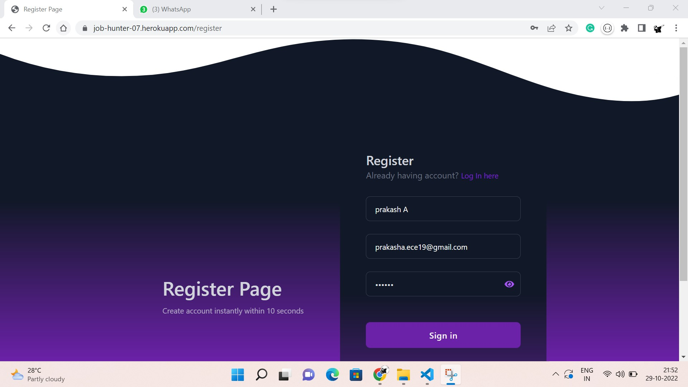
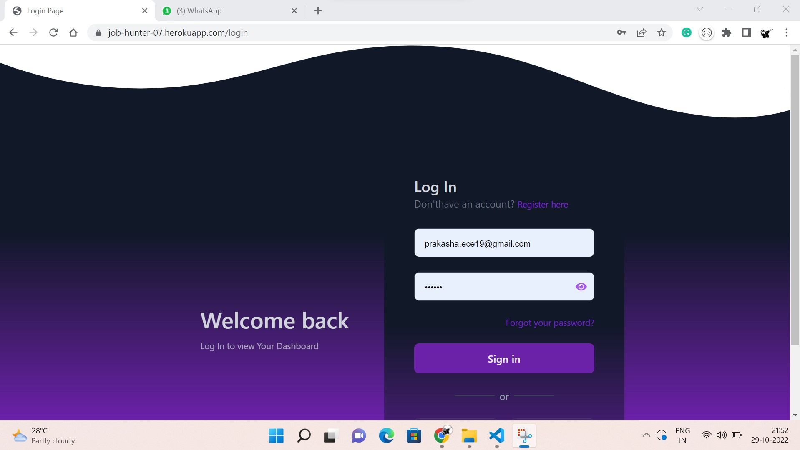
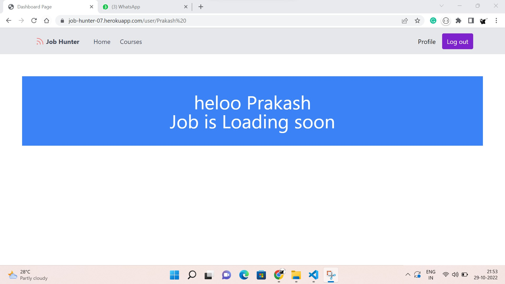

# Sprint 1

- The user are able to register in the portal
  - Created Database which collect the user name,email,password and assigned the unique id for each user.
  - The password which has encrypted using algorithm: SCRYPT
- The user able to log  in by using email id and password
  - when user log in the credentials are verified in db2 if it's correct redirect to dashboard
  - when user log in the session has been saved and also when user log in fetch the user Data
  - when user clicks the log out session is popped 
- The individual user profile page has created
    - The user name, email id and skill has shown in the profile page
- The individual dashboard has created 
    - In currently show  user name alone . In future updated the job posts matched on skill set 

## The link for Output sprint 1 
https://job-hunter-07.herokuapp.com/

## Appendix

- Responsive for all devices

## Output Screenshots 
## Home page

## Register page

## Log in page

## Dashboard

## Profile

## Mobile View

