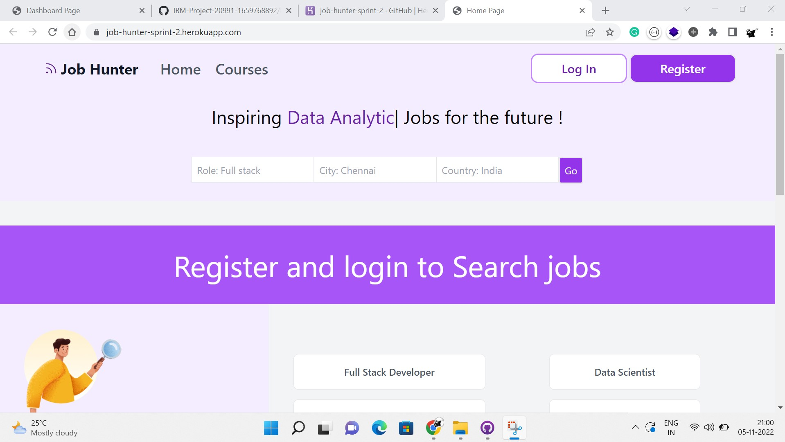
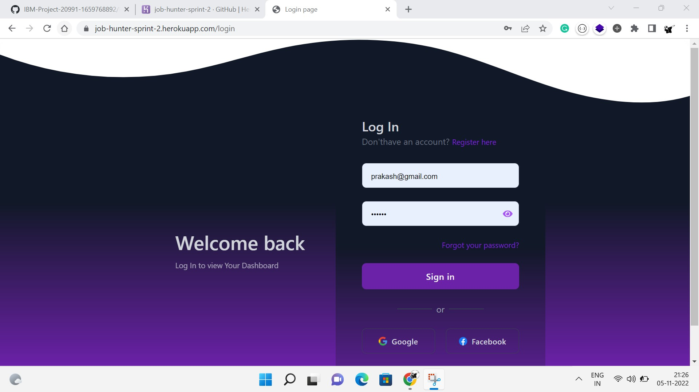
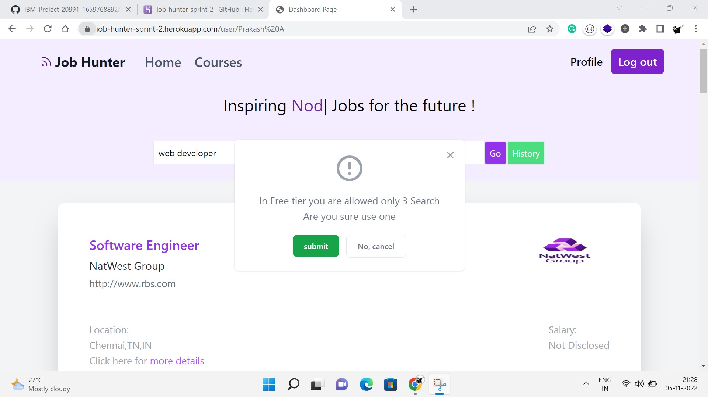
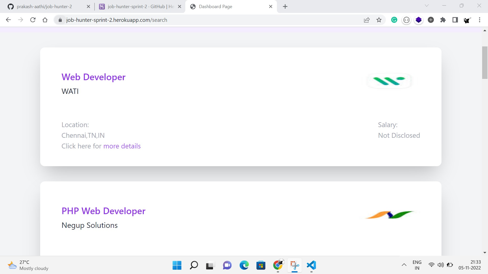
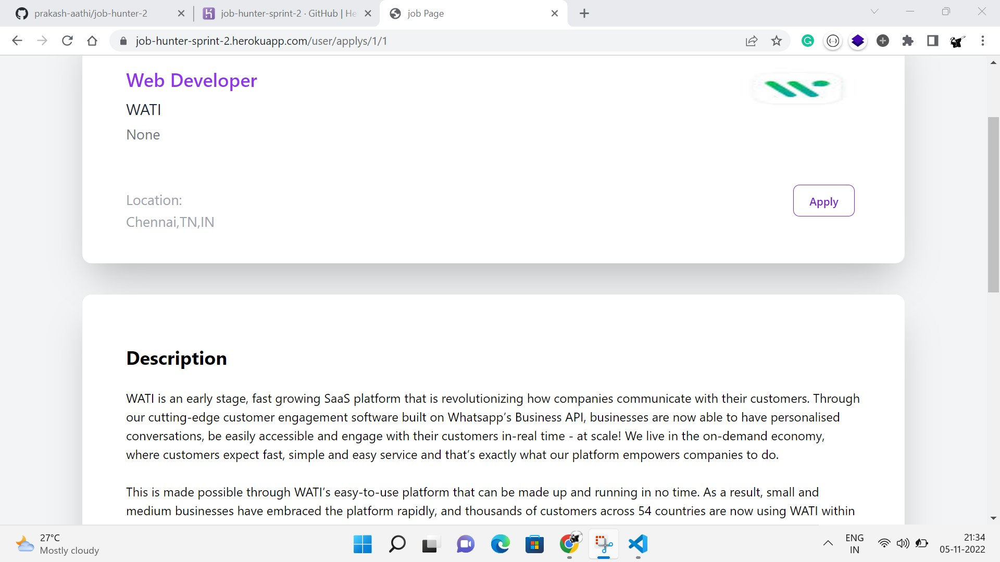
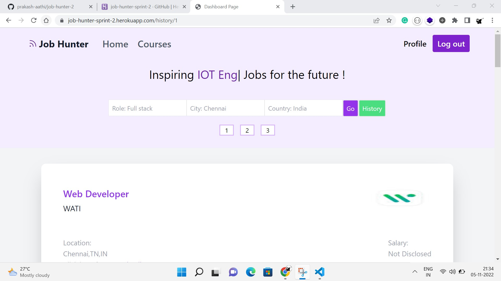
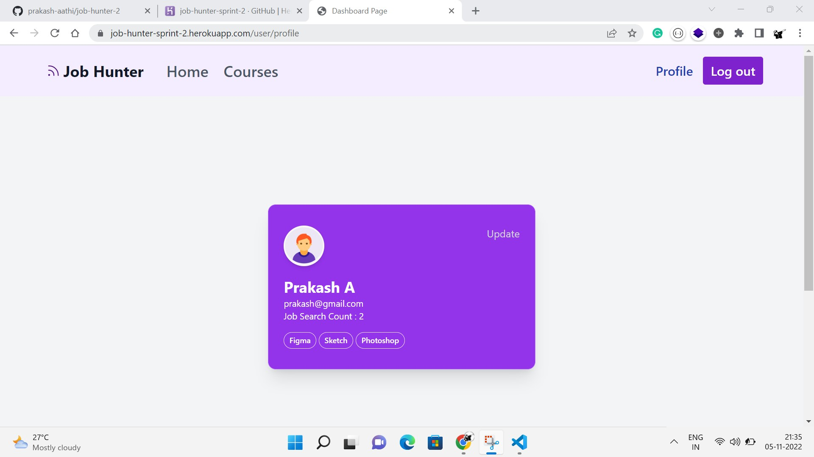
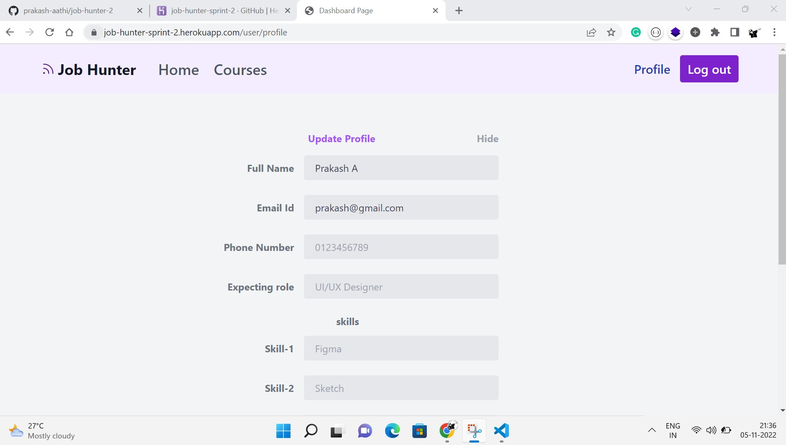
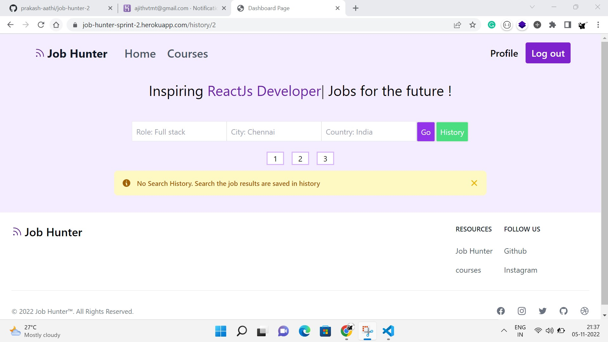

# Sprint 2
Sprint 2 status
- Created a Landing page Which consists of nice UI animation
- Connected Job search API which fetches jobs. The parameters are the required job title and location to fetch jobs.
  - The API free tier plan fetch limit is lesser so this project allowed only 3 searches for each user
  - In the profile section the job search Limits are shown
  - The Searched job results are stored in the database.
- The user requested the search history of the job the search results are shown
  - A job search history page was created. It shows the search history of the user
- Created apply page when the user searches the job, the job results are shown in the dashboard. If clicked the particular job it redirects to apply page.
  - The apply page consists of Job detailed description and apply link.
- Made more interactive and added alerts and prompts.
  - Register page validate name, email, and password if it is not alert as shown
  - If the user used more than 3 limits alert is shown
  - without login if the searches for the job it shows log in or register
  - The user clicks the search button it shows a prompt, confirm to the search job

# The link for Output sprint 2 
https://job-hunter-sprint-2.herokuapp.com/


## API Reference

Use this API to search for jobs posted across the web in real-time from many major and minor job sites - LinkedIn, Indeed, Glassdoor, ZipRecruiter, BeBee and others using the largest and most comprehensive job aggregate on the web - powered by Google Jobs.

#### Request Api format

```http
request("GET", url, headers=headers, params=querystring)
```

| Parameter | Type     | Description                       |
| :-------- | :------- | :-------------------------------- |
|`job title`| `string` | **Required**. Job title of job |
|`Location`| `string` | **Required**. Location of job |


#### Response Schema
- type:"object"
- properties:
  - status:
    - type:"string"
  - request_id:
    - type:"string"
  - data:
    - type:"array"
    - items:
      - type:"object"


### Output Screenshots 











