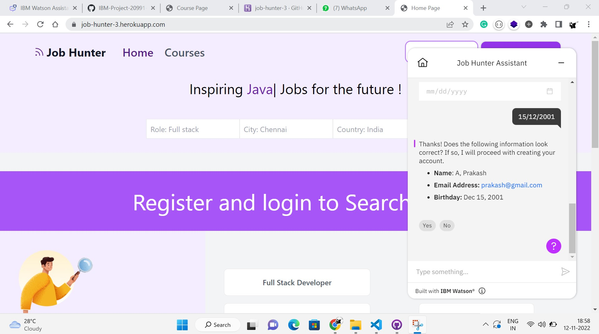
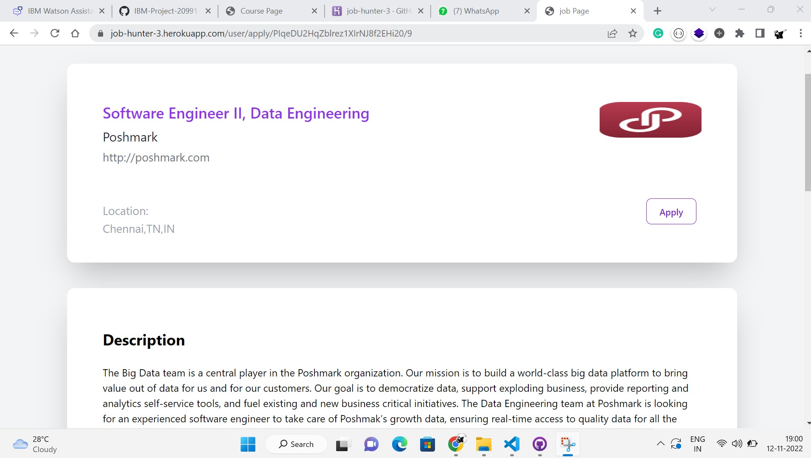
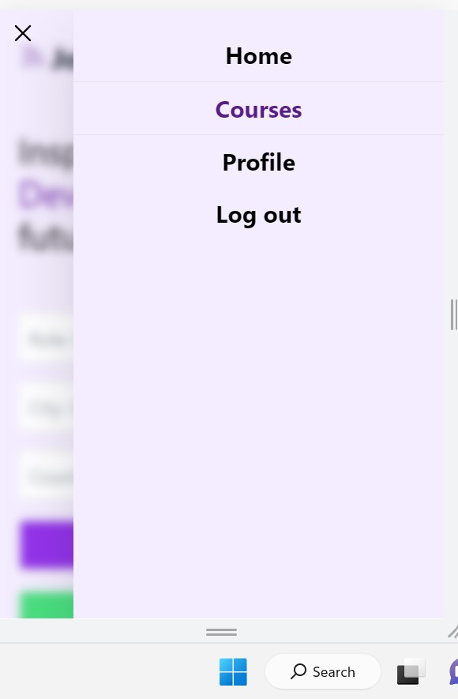
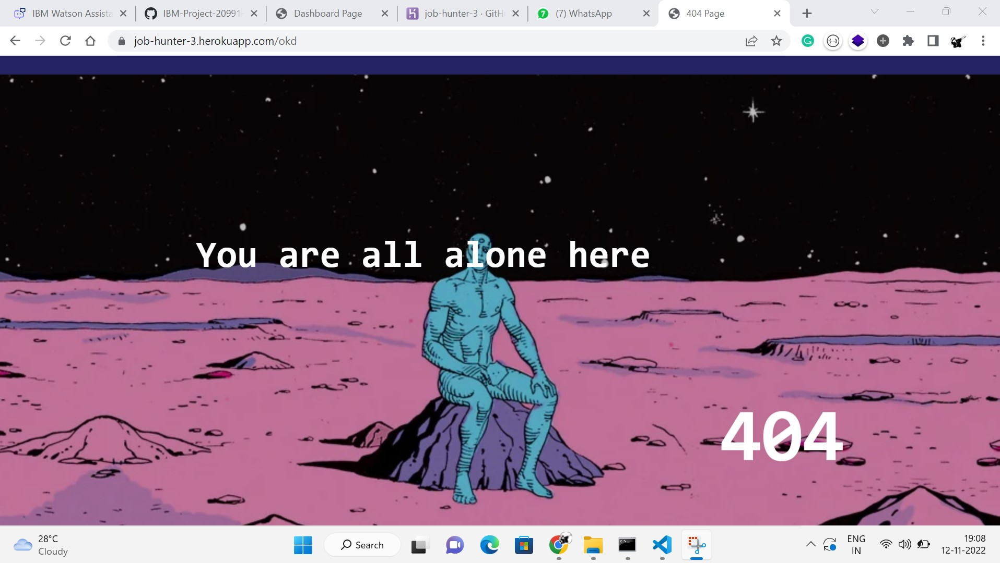

# Sprint 3

Sprint 3 status

- Integrated Bot or Virtual Assistant. Through this bot, the User can Register the account and the details are get from the IBM cloud account. Through the details, we create an account.
- The bot is trained in some basic actions.
- The Pagination button is created on the dashboard page through this navigate more jobs.
- Added 404 error page so user entered the wrong URL it redirects to the 404 Error page
- In sprint 2 has a bug in Apply job page and the course page now fixed it.
- Added active navigation bar. when the page is in a course, profile the navigation bar is highlight the navigate button.

### The link for Output sprint 2 
https://job-hunter-3.herokuapp.com/

## Feedback

If you have any feedback to improve, please reach out to us at prakashaathi321@gmail.com

## Screenshots

